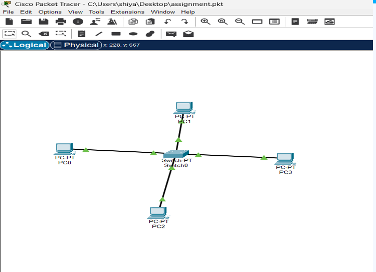
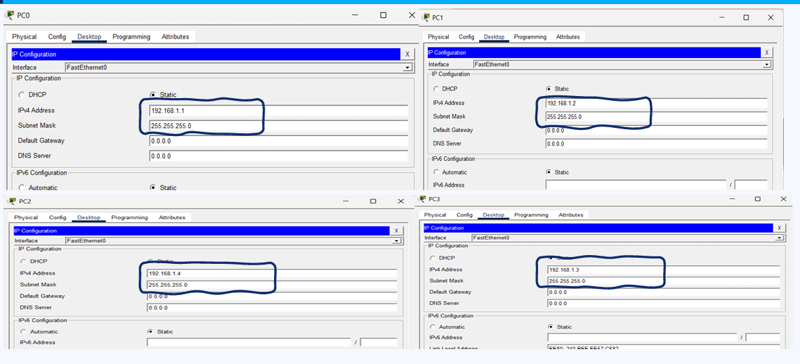
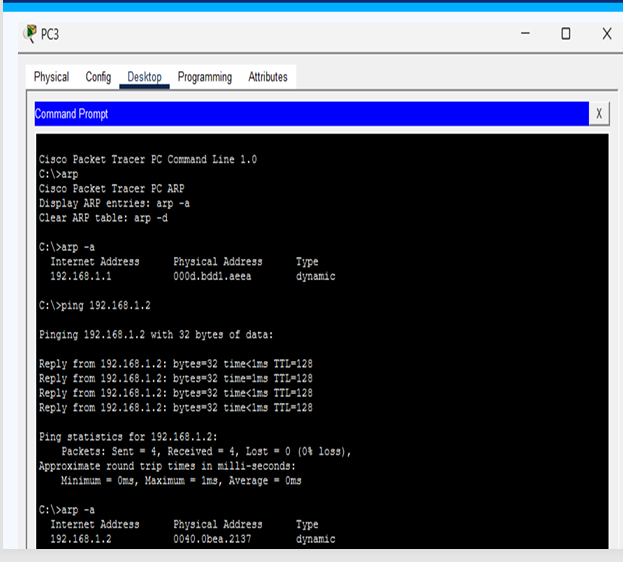
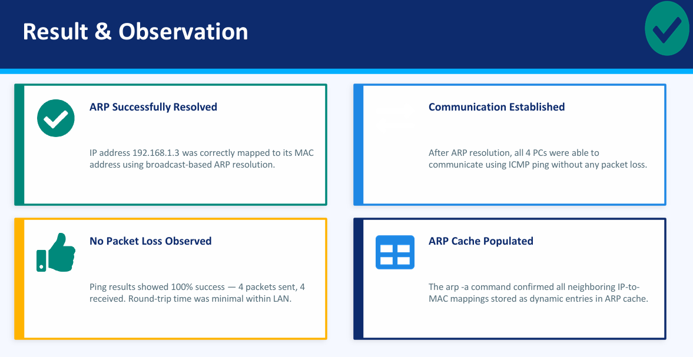

# ARP Configuration using Cisco Packet Tracer

## Overview
This project demonstrates the implementation and analysis of the Address Resolution Protocol (ARP) using Cisco Packet Tracer. The simulation shows how devices in a Local Area Network (LAN) resolve IP addresses into MAC addresses for successful communication.
The project was developed as part of the Computer Communication Networks (CCN) subject in Sem-4 (ECE).

---

## Guided By
Prof. (Dr.) Nehal Shah  
Prof. (Dr.) Dhiren Bhagat

---

## Team Members
- Khushi Desai
- Siya Bhalala
- Haiya Patel
- Jharna Nakrani

---

## Objective
- Understand the working of ARP protocol
- Learn IP address to MAC address mapping
- Simulate ARP communication in Cisco Packet Tracer
- Observe ARP Request and ARP Reply packets
- Analyze ARP cache entries using command-line tools

---

## Software Used
- Cisco Packet Tracer

---

## Network Topology
- 4 PCs connected to a switch
- Star topology
- Network: `192.168.1.0/24`

---

## Device Configuration

| Device | IP Address | Subnet Mask | Port |
|--------|-------------|-------------|------|
| PC-0 | 192.168.1.1 | 255.255.255.0 | Fa0/1 |
| PC-1 | 192.168.1.2 | 255.255.255.0 | Fa0/2 |
| PC-2 | 192.168.1.4 | 255.255.255.0 | Fa0/4 |
| PC-3 | 192.168.1.3 | 255.255.255.0 | Fa0/3 |

---

## Introduction to ARP
ARP (Address Resolution Protocol) is used to map an IP address to a MAC address within a LAN environment.

- Operates between Network Layer and Data Link Layer
- Uses broadcast and unicast communication
- Essential for Ethernet-based communication

---

## Working Principle

### Step 1: ARP Request
The sender broadcasts:
"Who has this IP address?"

### Step 2: ARP Reply
The target device responds with its MAC address.

### Step 3: ARP Cache
The sender stores the IP-to-MAC mapping in its ARP table for future communication.

---

## Commands Used

```bash
ping 192.168.1.3
arp -a
```

---

## Output Observation
- Successful ARP resolution observed
- MAC addresses dynamically stored in ARP cache
- ICMP ping communication successful
- No packet loss detected

---

## Screenshots

### Network Topology


### ARP Commands


### ARP Table Output


### Results at the End 


---

## Advantages of ARP
- Automatic MAC address discovery
- Simplifies LAN communication
- Reduces manual configuration
- Works transparently in the background

---

## Limitations
- Works only within LAN
- Vulnerable to ARP spoofing attacks
- No built-in authentication mechanism

---

## Learning Outcomes
- Understanding ARP workflow
- Practical exposure to Cisco Packet Tracer
- Knowledge of packet-level communication
- ARP cache analysis and packet tracing

---

## Conclusion
This project successfully demonstrated the practical implementation of ARP in a switch-based LAN using Cisco Packet Tracer. The simulation provided hands-on understanding of ARP request/reply operations, MAC address resolution, and packet flow analysis within a local network.

---

## Project Type
Mini Project – Computer Communication Networks (CCN)# ARP-Simulation-Using-Cisco-Packet-Tracer
ARP Configuration using Cisco Packet Tracer
